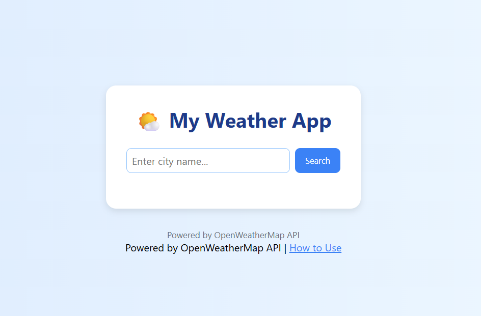

# 🌤️ Weather App

A simple weather app built with HTML, CSS, and JavaScript.  
It uses the OpenWeatherMap API to display real-time weather information.
---

## 📸 Screenshot

---
## ✨ Features
- Search weather by city name
- Displays temperature, weather condition, humidity, wind speed
- Clean and responsive design
- Uses OpenWeatherMap API
- Includes a How-To-Use guide

## 📂 Project Structure
- `index.html` – Main UI
- `style.css` – Styling
- `script.js` – API logic
- `how-to-use.html` – Instructions page

## 🚀 Live Demo
[Click to View](https://vishal-webdev3.github.io/weather-app/)

## 👩‍💻 Author
Made  by Vishal 
